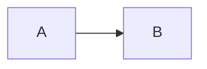
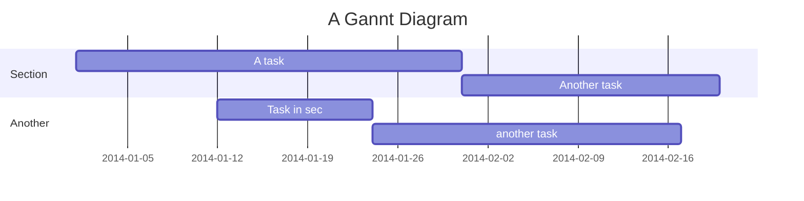
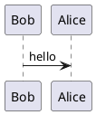

---
{"dg-publish":true,"permalink":"/about/markdown/md-sintaxis/"}
---

# Markdown

Markdown es un lenguaje de marcado simple que permite formatear texto fácilmente en un editor de texto plano, utilizando una sintaxis mínima y fácil de leer.

El renderizado de Markdown se realiza con un motor de Javascript que lo convierte en formato web, HTML para la estructura y CSS para los estilos. Y este formato web se muestra gracias a un navegador web.

> Obsidian es un Google Chrome "disfrazado", ya que utiliza electronJS un framework que combina chromium + nodeJS, para crear crear aplicaciones multiplataforma.

Algunos temas de Obsidian integran estilos especiales para formatos de Markdown, como infoboxes, grids, tarjetas. Un ejemplo es [ITS Theme Documentación](https://publish.obsidian.md/slrvb-docs/ITS+Theme/ITS+Theme) usado para esta wiki.

A continuación se cita la sintaxis básica de Markdown.

## Sintaxis de markdown

### Cabeceras
```
# Cabecera 1
## Cabecera 2
### Cabecera 3
#### Cabecera 4
##### Cabecera 5
###### Cabecera 6
```
# Cabecera 1
## Cabecera 2
### Cabecera 3
#### Cabecera 4
##### Cabecera 5
###### Cabecera 6

### Émfasis
*Este texto irá en cursiva*
Este texto también estará en cursiva

**Este texto estará en negrita
Este texto también estará en negrita.

==Este texto está subrayado==

```
*Este texto estará en cursiva*

Este texto también estará en cursiva

**Este texto estará en negrita

Este texto también estará en negrita.

==Este texto está subrayado==
```

### Listas
```
#### Desordenadas
* Item 1
* Item 2
  * Item 2a
  * Item 2b
#### Ordenadas
1. Item 1
2. Item 2
3. Item 3
   1. Item 3a
   2. Item 3b
```

#### Desordenadas
* Item 1
* Item 2
  * Item 2a
  * Item 2b
#### Ordenadas
1. Item 1
2. Item 2
3. Item 3
   1. Item 3a
   2. Item 3b

### Casillas de selección
```markdown
- [ ] Uncheckd
- [x] Checked
```

- [ ]  Uncheckd
- [x]  Checked

### Etiquetas / tags
Haz click en la etiqueta de abajo para ver el contenido en otras páginas con la misma etiqueta.
#etiqueta

### Notas de pie de página
```markdown
Este es un ejemplo de cómo agregar una nota al pie de página[^1].

[^1]: Aquí hay información extra en el pie de página
```

Este es un ejemplo de cómo agregar una nota al pie de página[^1].

[^1]: Este es el texto de la nota al pie.

---

### Archivos:

> [!warning] No se recomienda poner archivos muy pesados. Para no sobrecargar la web estática.

#### Documentos (.md, .html, .excalidraw, .pdf)
```markdown

<div class="transclusion internal-embed is-loaded"><div class="markdown-embed">


# Formula

> [!summary] Formula
> $\huge
> {\color{cyan} F} = {\color{yellow} m} \cdot {\color{red} a} 
> $
> > Variables:
> > - $\large \color{cyan} F$: the force generated
> > - $\large \color{red} a$: the acceleration the object
> > - $\large \color{yellow} m$: the mass of the object

## Explanation

- Equation of the force, force is equal mass multiplied by acceleration. 
- Basically F=ma 

</div></div>
  - Insertar documento completo


<div class="transclusion internal-embed is-loaded"><div class="markdown-embed">


## Explanation

- Equation of the force, force is equal mass multiplied by acceleration. 
- Basically F=ma 

</div></div>
  - Insertar cabecera del documento


<div class="transclusion internal-embed is-loaded"><div class="markdown-embed">


- Basically F=ma 

</div></div>
 - Insertar frase del documento
```


<div class="transclusion internal-embed is-loaded"><div class="markdown-embed">


# Formula

> [!summary] Formula
> $\huge
> {\color{cyan} F} = {\color{yellow} m} \cdot {\color{red} a} 
> $
> > Variables:
> > - $\large \color{cyan} F$: the force generated
> > - $\large \color{red} a$: the acceleration the object
> > - $\large \color{yellow} m$: the mass of the object

## Explanation

- Equation of the force, force is equal mass multiplied by acceleration. 
- Basically F=ma 

</div></div>


<div class="transclusion internal-embed is-loaded"><div class="markdown-embed">


## Explanation

- Equation of the force, force is equal mass multiplied by acceleration. 
- Basically F=ma 

</div></div>


<div class="transclusion internal-embed is-loaded"><div class="markdown-embed">


- Basically F=ma 

</div></div>


#### Imágenes (.jpg, .png, .svg)

```markdown
 

![[github-logo.png]]
```


#### Audios (mp3, .wav, .ogg)

```html
<audio controls>  
  <source src="../recursos/audio/flute.mp3" type="audio/mp3">
  audio not supported
</audio>

![[flute.mp3\|flute.mp3]]
```

<audio controls>  
  <source src="../recursos/audio/flute.mp3" type="audio/mp3">  
  audio not supported
</audio>

![[flute.mp3]]

#### Videos (.mp4, .webm)
> [!warning] Usando el generador estático HUGO, no es posible instertar videos mediante `![[(video.mp4]]` es necesario usar HTML con la ruta del video.

Si usamos la plantilla de Digital Gardens es recomendable escribirlo en formato markdown, ya que el plugin se encarga de convertir las rutas en formato válido.

```html
<video src="../recursos/video/Bunny.mp4" controls></video>

![[Bunny.mp4\|Bunny.mp4]]

<iframe width="560" height="315" src="https://www.youtube-nocookie.com/embed/1AeihtlrAkU?si=ZmtKlUeIU_LYpgSr" title="YouTube video player" frameborder="0" allow="accelerometer; autoplay; clipboard-write; encrypted-media; gyroscope; picture-in-picture; web-share" referrerpolicy="strict-origin-when-cross-origin" allowfullscreen></iframe>
```

<video src="../recursos/video/Bunny.mp4" controls>Not working</video>

![[Bunny.mp4]]

<iframe width="560" height="315" src="https://www.youtube-nocookie.com/embed/1AeihtlrAkU?si=ZmtKlUeIU_LYpgSr" title="YouTube video player" frameborder="0" allow="accelerometer; autoplay; clipboard-write; encrypted-media; gyroscope; picture-in-picture; web-share" referrerpolicy="strict-origin-when-cross-origin" allowfullscreen></iframe>


### Enlaces o links

```markdown
[[wikiterra\|wikiterra]]
[[wikiterra#Objetivo\|wikiterra#Objetivo]]
[[wikiterra#^intro1\|wikiterra#^intro1]]
[[wikiterra\|WikiTerra - Una wiki de nuestro cosmos]]
[Hugo](https://gohugo.io)
```

[[wikiterra]]
[[wikiterra#Objetivo]]
[[wikiterra#^intro1]]
[[wikiterra|WikiTerra - Una wiki de nuestro cosmos]]
[Hugo](https://gohugo.io)

### Bloques de referencia

```markdown
> Si he visto más lejos es por estar de pie sobre los hombros de Gigantes.
```

> Si he visto más allá es porque me he subido a hombros de gigantes.

### Código en línea

```markdown
El `código` en línea tiene `marcas de retroceso` a su alrededor.
```

El `código` en línea tiene `marcas de retroceso` a su alrededor.

### Bloques de código

\`\`\`go
func main() {
    fmt.Println("Hello World")
}
\`\`\`

```go
func main() {
    fmt.Println("Hello World")
}
```

### Tablas

```markdown
| Syntax    | Description |
| --------- | ----------- |
| Header    | Title       |
| Paragraph | Text        |
```

| Syntax    | Description |
| --------- | ----------- |
| Header    | Title       |
| Paragraph | Text        |

---

### Callouts

```
> [!NOTE] Título de la nota
> Información

> [!WARNING] Una advertencia
> Esto es una advertencia

> [!NOTE]+ Abrir por defecto
> Llamada plegable/colapsable

> [!FAQ]- Cerrado por defecto
> Llamada plegable/colapsable

> [!TIP] Llamadas anidadas
> Texto dentro del aviso
> > [!EXAMPLE] Llamada interna
> > Múltiples capas anidadas
> > [!TODO] Texto dentro del aviso
```
> [!NOTE] Título de la nota
> Información

> [!WARNING] Una advertencia
> Esto es una advertencia

> [!NOTE]+ Abrir por defecto
> Llamada plegable/colapsable

> [!FAQ]- Cerrado por defecto
> Llamada plegable/colapsable

> [!TIP] Llamadas anidadas
> Texto dentro del aviso
> > [!EXAMPLE] Llamada interna
> > Múltiples capas anidadas
> > [!TODO] Texto dentro del aviso

---

## Lenguajes de marcado soportados
Obsidian soporta de forma nativa la integración con Canvas (formato JSON), Excalidraw (formato JSON), KaTeX, Mermaid y PlantUML mediante convertidores en JavaScript y plugins especializados. Además con plugins se pueden usar otros como Graphviz, AsciiMath, Timeline, Chess, Dita.

### Canvas
```md
![[mindmap-luz.canvas|mindmap-luz]]
```

![[mindmap-luz.canvas|mindmap-luz]]

### Excalidraw
```md
![[squares.excalidraw\|squares.excalidraw]]
```

![[squares.excalidraw]]

### KaTEX (formulas matemáticas)
```latex
$ E = mc^2 $
```

$$ E = mc^2 $$

### Mermaid (diagramas)
```txt
``mermaid
	graph LR;
		A--> B
``

``mermaid
	gantt
		title Diagrama de Gannt
		dateFormat YYYY-MM-DD
		section Section
		A task           :a1, 2014.01-01, 30d
		Another task     :after a1, 20d
		section Another
		Task in sec      :2014.01-12, 12d
		another task     : 24d
``
```




---

### PlantUML  (diagramas UML)
> To render PlantUML in Obsidian.md you need to install the plugin PlantUML.



## References
- [Markdown Syntax](https://www.markdownguide.org/basic-syntax/)
- [Hugo Markdown](https://gohugo.io/content-management/formats/#markdown)
